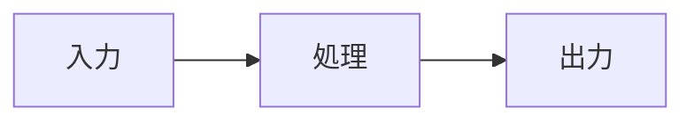

{/*
  記事テンプレート。content/posts/ に任意のファイル名でコピーして使う。

- ファイル名がそのまま slug（URLは /post/ + slug）になる
- frontmatter の必須項目は title / date / category
- category は src/constants/categories.ts のどれか（個人開発 / 書評 / 雑記）
- ogImage は自動生成（pnpm og）なので通常は書かない。差し替えたいときだけ frontmatter に追加する
- 記法の一覧はこのファイル末尾の「記法メモ」を参照
*/}

## 1. この記事の要約

- この記事で何をしたのかを1〜3行で
  - 補足があればネストして書く

## 2. はじめに

書こうと思ったきっかけや背景。読者が「自分に関係ある話だ」と思える入口にする。

参考にしたサイトや作ったものはURLを1行だけの段落に置くとリンクカードになる。

https://example.com

### モチベーション

何が課題で、なぜやろうと思ったのか。

## 3. やりたいこと・要件

- 満たしたかったこと
- 諦めたこと・スコープ外にしたこと

## 4. やったこと・構成

構成や手順の説明。図で見せたいときは mermaid が使える。



コードは言語を指定するとシンタックスハイライトされる。

```ts
export function example() {
  return "hello";
}
```

### 気をつけたこと: 見出しに具体的な内容を書く

つまずいた点や、判断した理由を書く。:red[特に伝えたい一文]はディレクティブで強調できる。

画像は R2（asset.imarin.net）にアップロードして `ImageGallery` で貼る。
alt には画面の内容が伝わる説明を、caption には一言の補足を書く。

<ImageGallery
  images={[
    { src: "https://asset.imarin.net/posts/記事のslug/画像名.webp", alt: "画像の内容を説明する文章", caption: "キャプション" },
  ]}
/>

## 5. 作ってみて感想

やってみてどうだったか。良かったこと、次にやりたいこと。

## おわり

まとめと締め。

ではまた( ´ ▽ ` )

## 参考リンク

- [リンクタイトル](https://example.com)

{/*
  ---------------- 記法メモ ----------------

  見出し
    h2〜h4 に自動でアンカーid が付き、目次に載る。h2 は下線付きスタイル。

  リンクカード
    URLだけの段落 → ビルド時にOGPを取得してカード表示（src/lib/remark-link-card.ts）。
    本文中に混ぜたいときは通常の [text](url) を使う。

  文字装飾（remark-directive）
    サイズ: :large[テキスト] :xl[テキスト] :sm[テキスト]
    色:     :red[] :blue[] :green[] :yellow[] :orange[] :pink[] :purple[] :gray[]
    入れ子: :large[:red[大きい赤字]]

  出典
    ::cite[書籍名 より引用] を独立行に置くと `<cite>` になる。
    引用ブロック内で使うときは `>` だけの行を挟む。

  ```markdown
  > 引用文
  >
  > ::cite[書籍名 紹介文抜粋]
  ```

  改行
    remark-breaks が入っているので、単純な改行がそのまま `<br>` になる。

  表・打ち消し線など
    remark-gfm が有効。

  公開前チェック
    1. pnpm lint
    2. pnpm og（OGP画像を生成 → .og/ の中身を R2 の og/ にアップロード）
    3. 記事の画像も R2 にアップロード
    4. デプロイ（アップロードはデプロイより先に済ませる）
*/}
