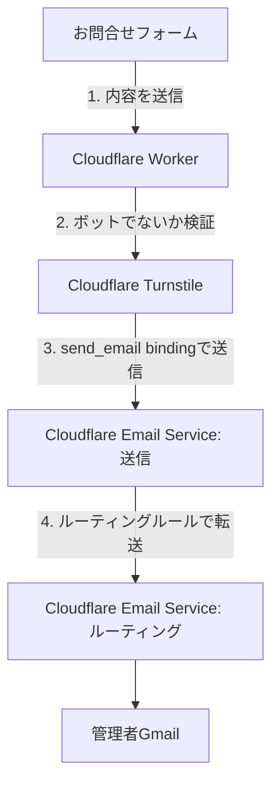

## 1. この記事の要約

- Cloudflare Workers + Turnstileを使った自作の問い合わせフォームを実装しました。
  - サードパーティのメールサービスを使わずCloudflareの中だけで完結する構成にした
  - 問い合わせ内容を保存しない構成にした

## 2. はじめに

イラストの活動をしている妻のポートフォリオサイトを作っていました。

https://seki-saki.com/

https://github.com/imarin309/seki-saki.com/tree/main

僕は正直デザインとかの経験はほぼないのですが、figmaのAIを使ってデザインして作ってみました。
割とオシャレに出来てていい感じなんじゃないかと思って気に入ってます。
:red[デザインの経験がなくてもいい感じのデザインでサイトを作れる、、いい時代になったものです。( ´ ▽ ` )]

ただ、お問合せページについては一点課題があってメールアドレスのリンクをクリックしたらメールアプリを起動してもらってそのままメールを送る形式にしていました。

<ImageGallery
  images={[
        { src: "https://asset.imarin.net/posts/contact-form/contact-befere.webp", alt: "seki-saki.com_お問い合わせフォーム改修前", caption: "contact-form before" },
    ]}
/>

これはメールアプリを開いて宛先や件名を入力する必要があり、問い合わせのハードルが高いと感じていました。

そこで、サイト内で送信まで完結する問い合わせフォームを作ることにしました。

## 3. やりたいこと・要件

- ユーザーがメールアプリ不要でページ内でお問合せを作成できる。
- 運用が手間にならない。
  - メールが来たら普段使ってるメールボックスに入る
- セキュリティ的に堅牢
  - 問い合わせ内容をサーバーに保存しない
  - Bot対策を入れる

## 4. 完成した内容・構成

<ImageGallery
  images={[
        { src: "https://asset.imarin.net/posts/contact-form/contact-after.webp", alt: "seki-saki.com_お問い合わせフォーム改修後", caption: "contact-form after" },
    ]}  
/>



お問合せフォームからCloudflare Workerを使ってメールを送信APIをキックし、Cloudflare Turnstileでbotの検証をし、Cloudflare Email Serviceでメールを送受信するという、:red[全部Cloudflareに任せる]という構成にしました。
一点注意なのが、`send_email` bindingで任意の宛先にメールを送るにはCloudflare Workersの月額5ドルのWorkers Paidが必要ということです。

ここで「送信」と「ルーティング」を別ステップとして図に描きましたが、実体はどちらもCloudflare Email Serviceという同じ製品の機能です。Workerは`send_email` bindingを使って自ドメイン宛（`contact@seki-saki.com`）にメールを送信しているだけで、それをGmailまで転送しているのはEmail Serviceのルーティングルールです。Workerから直接Gmailへメールを送っているわけではありません。

実はメールを送信する部分をResendのようなサードパーティのメールAPIを使う選択肢もあり、そちらを使えばWorkers Paidを契約する必要はなかったので最後まで悩みました。

5$払ってCloudflareで完結させることを選んだのは、:pink[問い合わせ内容という個人情報を含みうるデータを外部のSaaSに渡したくなかった]という理由です。

### 気をつけたこと: リクエストの検証

Worker側ではフロントからお問合せが送信された後に下記の内容をチェックしてメール送信をしています。

- 自分のサイトのドメイン以外から送られてきたリクエストじゃないか
- 名前・メールアドレスなどの入力値のバリデーション
- Turnstileの検証（人間が操作しているか）を通っているか

ただし、Originヘッダーのチェックはブラウザ経由のリクエストには効きますが、curlなどブラウザを介さないリクエストだとOriginヘッダー自体を自由に偽装できてしまうので、これ単体では強い防御にはなりません。

あくまでTurnstileの検証とセットで初めて意味を持つ、一段目のフィルタという位置付けです。

### 気をつけたこと: 件名やメールアドレスの改行でヘッダーインジェクションが起きないように

件名の入力欄に改行文字を含められる状態だと、メールを組み立てるときにその改行以降が新しいヘッダーとして解釈されてしまうことがあります。
以下のように件名に

```text
お問い合わせ
Bcc: attacker@example.com
```

のような改行入りの文字列を入れられると、送信するメールに勝手なBccが追加されてしまう、といった悪用ができてしまう可能性がありました。
ヘッダーインジェクションと呼ばれる脆弱性です。

メールアドレスはもともと正規表現で改行を含む空白文字を許容しない作りだったので対策は不要でした。
件名については、改行が含まれていたらすべて半角スペースに置き換えるようにして修正しました。

ちなみにこれはGithub Copilotのレビュー指摘で気づいたものでした。
一人で開発するときはgithub copilotのレビューはすごい便利。

## 5. 作ってみて感想

これまではメールアプリを開いて宛先や件名を打ち込んでもらう必要があったのが、サイト内で完結して送信できるようになったので、問い合わせのハードルはだいぶ下がったと思います。

それ以上に一番のよかったところは:red[お問合せフォームが設置してあるとちゃんとしたサイトっぽい！！]という満足感。

実装面で気に入っているのは、DBなどのリソースを使用せずにメールを送信するだけにできたところです。
心配性なのでユーザーから提供される可能性のあるデータを残したくなかった。

具体的には、Workerのログには`contact.validation_failed`のようなエラー種別を表す短い文字列しか出しておらず、名前・メールアドレス・本文といった入力内容そのものはログに一切残していません。

また、Cloudflare Email ServiceのEmail Preview機能もオフにして、メール本文がCloudflare側にプレビューとして保持されないようにしています。

## おわり

サードパーティのメール送信サービスを使わず、Cloudflareの中だけで問い合わせフォームを完結させることができました。
今回Cloudflare workerのpaidプランを課金したのですが、ブログの共通APIを導入したりとか、Cloud flare D1（SQLite系の小規模なDB）を入れるとか色々できそうなので、使って試してみたい。

## 参考リンク

- [Workers Pricing](https://developers.cloudflare.com/workers/platform/pricing/)
- [Cloudflare Email Service](https://developers.cloudflare.com/email-service/)
- [Send emails（send_email binding）](https://developers.cloudflare.com/email-service/get-started/send-emails/)
- [Route emails](https://developers.cloudflare.com/email-service/get-started/route-emails/)
- [Email Service Pricing](https://developers.cloudflare.com/email-service/platform/pricing/)
- [Turnstile: Server-side validation](https://developers.cloudflare.com/turnstile/get-started/server-side-validation/)

ではまた( ´ ▽ ` )
