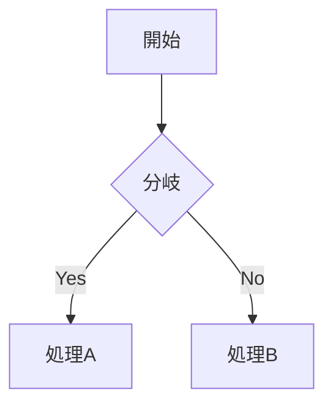

今回は以前から構想していたブログの移行が完了したので、その話をまとめます。

## 旧構成

もともとのブログ構成はこんな感じでした。

- ドメイン: お名前.com
- サーバー: さくらのレンタルサーバー
- ブログ: WordPress

ブログを始めようと思ったらよくある方法だと思います。
私はもともとはてなブログでアニメの感想とか書き始めていたのが最初でした。その後自分の資産としてブログを書きたいと思ったのがきっかけでWordPressで制作していました。

### WordPressなにが不満だったのか

#### カスタマイズできそうでできない

基本的にWordPressはテーマやプラグインの制約の中で記事を書きます。
使ってる画像のサイズが大きくてUIが壊れているとか、リンクのプレビューがうまくいかないとかよくあったのですが、原因がわからず改善が難しい。

また、サイトが遅い重いと思ってもテーマが原因なのか、プラグインなのか、自分がアップロードした画像なのか原因がわからずパフォーマンス改善をするのが難しかったです。

エンジニアであれば「中身のphpを読んで自分好みに変えればいいんじゃないの？」と思うかもしれませんが、WordPressには「フック」「ショートコード」「テンプレート階層」など独自の概念が多く、WordPress独自にキャッチアップが必要に感じる。管理画面からソースコードを直接編集するUIもシンタックスハイライトがなく、開発環境としてはかなり辛い。

#### パッケージ管理するのしんどい

気がつくとNode.jsのバージョンがずっと古いままになったりしていることが多数。

WordPressって自作ブログを作るコンセプトで、はてなブログなどと違い作った記事が自分の資産になるのが魅力だと思います。
一方で中身のソースコードも自分で管理する必要があるというのが落とし穴な気がした。

## 新しい構成

そこで思い切って全部移行することにしました。

- ドメイン: Cloudflare
- デプロイ: Cloudflare Pages
- フレームワーク: Next.js
- コンテンツ管理: Velite + MDX

リポジトリ

https://github.com/imarin309/imarin.net

### 記事の書き方

記事はMDXファイルに書きます。
ファイルの先頭に記事の情報を書いて、あとは本文を書くイメージ。

```md
---
title: "記事タイトル"
date: "2026-01-01"
category: "雑記"
description: "説明"
---

本文をここに書く
```

MDXはMarkdownの中にReactコンポーネントを埋め込めるのが特徴です。自分で作ったコンポーネントを記事内で呼び出せるので、通常のMarkdownでは表現できないUIを記事の中に組み込めます。
例えばこんな感じにmermaidのpreviewを追加したりとか。



このMDXファイルをVeliteというライブラリがビルド時に処理して、Next.jsが静的ページとして生成します。
GitHubにpushすればCloudflare Pagesが自動でデプロイしてくれるので、記事を書いてpushするだけで公開まで完了します。

### 旧記事の移行

WordPress上で記事をXMLとしてエクスポートして、
このXMLファイルをClaudeに渡して「MDX形式に変換して」と頼んだら、
フロントマター付きのMDXファイルを一気に生成してくれました。

手作業での移行は一切していないです。

### コスト比較

レンタルサーバー代が浮きました。

| | 旧構成 | 新構成 |
| --- | --- | --- |
| ドメイン | お名前.com<br/>年間1,200〜1,600円 | Cloudflare domain<br/>年間1,200〜1,600円 |
| ホスティング | さくらのレンタルサーバー スタンダードプラン<br/>年間6,600円 | Cloudflare pages<br/>ほぼ無料（Pagesの無料枠） |
| 画像を保管するストレージ | サーバーに含まれる | Cloudflare R2<br/>ほぼ無料（R2の無料枠） |

※2026/3時点

- ドメインは肌感覚なので取得するドメインによって料金は異なります。
- Cloudflare Pages 無料枠: ビルド500回/月、帯域・リクエスト数は無制限
  - https://developers.cloudflare.com/pages/platform/limits/
- Cloudflare R2 無料枠: ストレージ10GB-months、書き込み100万回/月、読み込み1,000万回/月、エグレス料金（転送費）なし
  - https://developers.cloudflare.com/r2/pricing/

→ 個人ブログレベルであれば普通に無料枠で収まりそう

## 移行してよかった

### 自由にカスタマイズできる

WordPressで感じていたストレスがほぼ全て解消されました。
というか自由にデザインできて記事を書くのが楽しい！

一例で言うとプラモ制作ブログの画像の表示方法。

https://calm-corner.com/posts/angela-balzac

imageGalleryというcomponentsを作って、captionを表示しつつクリックしたら拡大したり複数画像のときにいい感じの配置にしてくれるようにしました。

自分の思うように記事をかけるようになってモチベが上がりました。

また、先述のWordPressサイトのパフォーマンス問題も解消されました。
遅ければDevToolsで調べればいいし、エラーが出ればコードを直せばいいので「何かがおかしいけど原因がわからない」という状況がなくなりました。

### フロントエンドの勉強になる

僕は半年前にwebエンジニアとして転職してフロントエンドの経験が浅く勉強している最中なのですが、自分で作って実際に動くものを作るのは楽しい。
実際、記事をXで公開していいねをもらえたりしたときは単純に嬉しいし記事のデザインをよくしようという気持ちにつながるしモチベーションも上がる。

開発しててnext.jsとかtailwindCSSとかを使ってていい勉強になった。

### 記事もlintできる

`markdownlint` を導入したので、MDXファイル（記事）に対してもlintが走ります。
表記ゆれや記法の揺れを自動で検出してくれるので、「見出しの前に空行が必要」とか「リストのインデントが統一されていない」みたいな細かいミスを自動で直せます。

### Claudeなど生成AIツールとの相性がいい

記事を書いていて一番しんどかった作業がdescriptionを書くことでした。

descriptionとは検索結果に表示される100字前後の説明文のことで、毎回記事の要点を短くまとめる作業が億劫で後回しにしがちでした。

これを解決するために、Claude Codeのカスタムコマンド機能を使って
`/gen-description` というコマンドを作りました。

https://github.com/imarin309/imarin.net/blob/main/.claude/commands/gen-description.md

記事ファイルを指定するだけでClaudeが内容を読んでdescriptionを提案し、自動で書き込んでくれます。
個人的にブログ記事自体はある程度感情を入れて書きたいと思っててAIと相性が悪いと感じているものの、descriptionに関してはクローラー向けに機械がわかりやすいように書く認識なのでAIに作らせるのは合理的に感じました。

総じてテキストエディターで執筆しているので生成AIとの相性がいいのがgood。

## おわりに

Claude Codeとvibe codingしながら作りましたが、正直一人で作るのは無理でした。ありがとうclaude。

流入数がどう変わったかとかの観測はまだしていないのですが、個人的にはメリットしかなくて移行してよかった。

ではまた( ´ ▽ ` )
